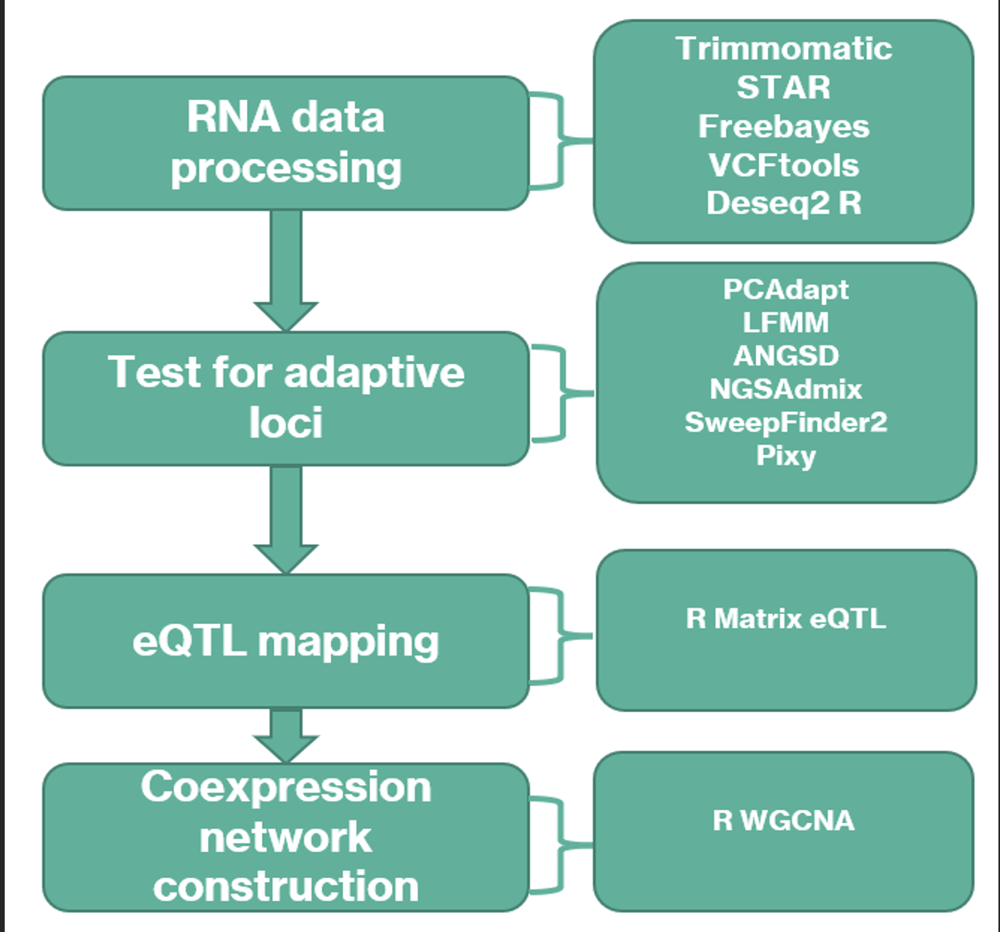

# Pleiotropy does not facilitate local adaptation in the Silverleaf sunflower (<i>Helianthus argophyllus</i>)

In this study, we explored connections between pleiotropy and local adaptation in the Texas endemic Silverleaf sunflower or 
<i>Helianthus argophyllus</i>. Populations of <i>H. argophyllus</i> exhibit a bimodal life history strategy consisting of tall, late-flowering forms and short early-flowering forms occurring in close geographical proximity. We suspect that the differential expression of life history traits within <i>H. argophyllus</i> populations might be linked to local adaptation and controlled by highly pleiotropic genes. We identified spatial selection, selective sweeps, and tested for local adaptation signatures. We assessed pleiotropy by examining if genes bearing adaptive mutations were more likely than expected to occupy central positions on gene coexpression networks. Our results show that candidate locally adapted genes showed significantly lower connectivity than non-adapted genes.

----------------------------------------------------------------------

### Genetic diversity and population structure

PCA (Fig. 1A) and FST (mean FST = 0.21) showed some genetic differentiation between the sampled populations. PC1 (18.4 PVE) and PC2 (13 PVE) showed a clear differentiation between north and coast samples. Admixture analysis using NGSAdmix suggests a population stratification into two distinct genetic groups at K = 2 representing the two sampled populations (Fig. 1B), with differences between the populations remaining at higher K values.

  
  

  <strong>Fig 1</strong>. Genetic differentiation and population structure in <em>Helianthus argophyllus</em>.  
  <strong>A</strong>: Genetic differentiation along the first two PCs. Percentages in brackets show the proportion of variance explained by each PC axis.  
  <strong>B</strong>: Approximate admixture proportions for each sampled individual at three different levels of K.  

----------------------------------------------------------------------

### Selection scans

Two methods, LFMM 2 and PCAdapt, were used to identify genetic regions associated with local adaptation in *Helianthus argophyllus*. LFMM 2 detects selection by analyzing environment-genotype associations, while PCAdapt identifies selection through population structure. In the LFMM model, population structure was controlled by four latent factors, and the main environmental variations were defined using the first five principal components (PCs) of 19 BIOCLIM variables, explaining 98.95% of the variation. The LFMM model identified 1,438 SNPs across 560 genes with selection signatures. The PCAdapt analysis found 4,968 SNPs across 1,122 genes as selection outliers. Ten SNPs in XX genes were identified by both methods, which was fewer than expected by chance. Genes with outlier SNPs from either method were considered candidates for local adaptation, while genes without outlier SNPs served as controls.

----------------------------------------------------------------------

### Proportion of eQTLs and eGenes in selection outliers

To assess if selection outlier loci were more pleiotropic than control genes, associations between SNPs and gene expression were tested for trans-regulatory variants. A total of 42,638 genes were used in the eQTL analysis, controlling for population structure with admixture proportions (K = 4). The analysis identified 1,824 eQTL genes (4.3%) associated with the expression of 3,129 eGenes (7.3%) at an FDR < 0.01. Of the 560 LFMM outlier genes, 114 (20.4%) were eQTLs, and 208 (18.5%) of PCAdapt outliers were eQTLs. Only 11 (2%) LFMM outliers and 24 (2.1%) PCAdapt outliers were eGenes. Both outlier gene sets had significantly more eQTLs and fewer eGenes compared to the rest of the transcriptome (p < 2.2e-16, Fisher’s exact test).

  

  <strong>Fig 2</strong>. Proportion of eQTLs and eGenes in candidate adaptive genes identified by LFMM and PCAdapt methods compared to the control. Error bars were calculated at 95% bootstrapped CI.  

----------------------------------------------------------------------

### Evidence of selection at outlier loci

Genetic differentiation, measured by FST, was significantly higher for LFMM outlier genes compared to control genes, while *Dxy* values were not significantly different. In contrast, PCAdapt outlier genes showed lower FST and higher Dxy than control genes, indicating distinct signatures between the two methods. Population mutation rate measures (*θπ* and *θW*) revealed that PCAdapt outlier genes in the north population had lower *θW* but no significant difference in θπ. In the coast population, PCAdapt outliers had significantly higher θπ. For LFMM outliers, θπ was higher in the north population but not significantly different in the coast population. LFMM outliers in the coast population had lower *θW* compared to controls. Further validation using *Fay and Wu's H* neutrality measure and the Composite Likelihood Ratio (CLR) test showed that outlier genes identified by both methods were significantly enriched for selective sweeps, with more negative *H* estimates compared to control genes. These results indicate that both LFMM and PCAdapt outlier genes are enriched for selective sweeps in both populations.

  

  <strong>Fig 3</strong>. Genetic differentiation and selective sweep at adaptive genes.  
  <strong>A</strong>: Weighted FST estimates at genes containing selection outliers, eQTLs, and eGenes compared to the transcriptome-wide background.  
  <strong>B</strong>: Distribution of CLR and  
  <strong>C</strong>: *Fay and Wu’s H* values across adaptive genes, eQTLs, eGenes, and the rest of the transcriptome. The horizontal line represents the median value of the transcriptome-wide background for all estimated values. 

-------------------------------------------------------------------------

### Connectivity of selection outliers

Gene co-expression networks were used to assess the pleiotropy of genes with selection outliers. The analysis identified 44 modules, with a median of 96 genes per module. Twenty-one modules contained more LFMM and PCAdapt genes than expected (p-value < 0.001, Fisher's exact test). The connectivity of candidate adaptive genes, eQTLs, and eGenes was examined, showing that PCAdapt outlier genes and eQTLs had higher connectivity than control genes (p-value < 2.2e-16). In contrast, LFMM outlier genes and eGenes had lower connectivity than control genes (p-value < 2.2e-16).

  <strong>Fig 4</strong>. Gene network connectivity at candidate adaptive genes.  Estimated connectivity of candidate adaptive genes, eGenes, and eQTLs compared to the transcriptome-wide control.  
  
---------------------------------------------------------------------
### Annotation of adaptation loci and gene co-expression networks

Gene overrepresentation analysis revealed significant enrichment of adaptive genes related to pollen recognition and protein serine/threonine kinase activity in both LFMM and PCAdapt genes. Gene network modules with more adaptive genes were involved in secondary metabolism pathways, including Alpha-Linolenic acid metabolism, Stilbenoid, diarylheptanoid, and gingerol biosynthesis, Carotenoid biosynthesis, Ether lipid metabolism, Histidine metabolism, and Glycerolipid metabolism.

  
  

  <strong>Fig 5</strong>. Gene ontology enrichment for biological processes of adaptive genes identified by LFMM (left) and PCAdapt (right).

 

 <!-- Added space before table -->

  <strong>Table 1</strong>. Annotation of some network modules containing adaptive genes more than expected by chance. The table shows the most significant pathway for each analyzed network module.

 

 <!-- Added space before table -->
  <table border="1" cellpadding="5" cellspacing="0" style="width: 100%;">
    <thead>
      <tr>
        <th style="width: 20%;">WGCNA Network Module</th>
        <th style="width: 10%;">Size</th>
        <th style="width: 15%;">KEGG ID</th>
        <th style="width: 30%;">Description</th>
        <th style="width: 25%;">p-value</th>
      </tr>
    </thead>
    <tbody>
      <tr>
        <td>Turquoise</td>
        <td>205437</td>
        <td>han00592</td>
        <td>Alpha-Linolenic acid metabolism</td>
        <td>1.047E-13</td>
      </tr>
      <tr>
        <td>Blue</td>
        <td>128000</td>
        <td>han00071</td>
        <td>Fatty acid degradation</td>
        <td>3.8487E-12</td>
      </tr>
      <tr>
        <td>Ivory</td>
        <td>17</td>
        <td>han00945</td>
        <td>Stilbenoid, diarylheptanoid, and gingerol biosynthesis</td>
        <td>5.8774E-11</td>
      </tr>
      <tr>
        <td>Red</td>
        <td>640</td>
        <td>han00906</td>
        <td>Carotenoid biosynthesis</td>
        <td>1.9047E-07</td>
      </tr>
      <tr>
        <td>Greenyellow</td>
        <td>207</td>
        <td>han04144</td>
        <td>Endocytosis</td>
        <td>6.5565E-06</td>
      </tr>
      <tr>
        <td>Dark grey</td>
        <td>148</td>
        <td>han00340</td>
        <td>Histidine metabolism</td>
        <td>1.2006E-05</td>
      </tr>
      <tr>
        <td>Light yellow</td>
        <td>96</td>
        <td>han00592</td>
        <td>Alpha-Linolenic acid metabolism</td>
        <td>2.2602E-05</td>
      </tr>
      <tr>
        <td>Black</td>
        <td>640</td>
        <td>han00190</td>
        <td>Oxidative phosphorylation</td>
        <td>0.00029138</td>
      </tr>
      <tr>
        <td>Green</td>
        <td>864</td>
        <td>han00561</td>
        <td>Glycerolipid metabolism</td>
        <td>0.00062053</td>
      </tr>
      <tr>
        <td>Pink</td>
        <td>445</td>
        <td>han03050</td>
        <td>Proteasome</td>
        <td>0.00062388</td>
      </tr>
      <tr>
        <td>Brown</td>
        <td>1340</td>
        <td>han03013</td>
        <td>Nucleocytoplasmic transport</td>
        <td>0.00113196</td>
      </tr>
      <tr>
        <td>Dark turquoise</td>
        <td>306</td>
        <td>han00230</td>
        <td>Purine metabolism</td>
        <td>0.00150759</td>
      </tr>
      <tr>
        <td>Steelblue</td>
        <td>32</td>
        <td>han00565</td>
        <td>Ether lipid metabolism</td>
        <td>0.00426168</td>
      </tr>
      <tr>
        <td>Yellow-green</td>
        <td>81</td>
        <td>han00750</td>
        <td>Vitamin B6 metabolism</td>
        <td>0.00574599</td>
      </tr>
      <tr>
        <td>Yellow</td>
        <td>1029</td>
        <td>han04820</td>
        <td>Cytoskeleton in muscle cells</td>
        <td>0.00938716</td>
      </tr>
    </tbody>
  </table>

 <!-- Added space after table -->

### Methods

- #### Sample Collection and RNA Sequencing
The study used 19 populations of *Helianthus argophyllus* representing two subpopulations. Seeds were grown in a growth chamber for 3 weeks, and above-ground tissue was frozen for RNA extraction. RNA was sequenced using Illumina's mRNASeq approach on a GAII platform with paired-end sequencing.

- #### Sequence Processing
RNA-seq data were processed with FastQC, trimmed with Trimmomatic, and aligned to the H. annuus reference genome using STAR. Variants were called with Freebayes, filtered with vcftools, and quality control was applied using criteria for read quality, coverage, and missing data.

- #### Genetic Diversity and Population Structure
Genetic diversity metrics (FST, θW, θπ, Tajima’s D) were calculated using ANGSD and pixy. Population structure was assessed using NGSAdmix and various estimators like Dxy, with genetic differentiation measured by FST in a sliding window of 5000 kb.

- #### Selection Outliers
Selection outliers were identified using the LFMM 2 and PCAdapt R packages. LFMM 2 used genotype-environment associations, while PCAdapt focused on population structure to identify locally adapted loci.

- #### eQTL and eGenes
Gene expression was analyzed using FeatureCounts and normalized with Deseq2. eQTLs were identified with MatrixEqtl, controlling for population structure through PCA of expression data and including the first two PCs as covariates.

- #### Selective Sweeps
Selective sweeps were identified using Fay and Wu’s H and CLR methods with SweepFinder2, focusing on selection outlier SNPs and genes. The analysis considered SNPs in selected genomic regions.

- #### Statistical Comparisons
Statistical comparisons of genetic estimators across selection outliers, eQTLs, eGenes, and control genes were performed using the Wilcoxon signed-rank test.

- #### Gene Coexpression Networks
Gene coexpression networks were constructed with the WGCNA R package, using a power threshold of six for adjacency matrices. Connectivity differences between selection outliers, eQTLs, eGenes, and the transcriptome-wide background were analyzed.

- #### Annotation of Genes and Network Modules
Gene and pathway overrepresentation analysis of selection outliers and coexpression modules were performed using clusterProfiler. Gene IDs were extracted using NCBI-blast for alignment to the HanXRQr2.0-SUNRISE genome, and KEGG pathway analysis was conducted using the ‘enrichKEGG’ function.

  

### References

1. Tenaillon O. The Utility of Fisher’s Geometric Model in Evolutionary Genetics. *Annu Rev Ecol Evol Syst.* 2014;45:179. doi:[10.1146/ANNUREV-ECOLSYS-120213-091846](https://doi.org/10.1146/ANNUREV-ECOLSYS-120213-091846)

2. Hämälä T, Gorton AJ, Moeller DA, Tiffin P. Pleiotropy facilitates local adaptation to distant optima in common ragweed (*Ambrosia artemisiifolia*). *PLoS Genet.* 2020;16:e1008707. doi:[10.1371/JOURNAL.PGEN.1008707](https://doi.org/10.1371/JOURNAL.PGEN.1008707)

3. Wagner GP, Zhang J. The pleiotropic structure of the genotype–phenotype map: the evolvability of complex organisms. *Nature Reviews Genetics.* 2011;12:3:204–213. doi:[10.1038/nrg2949](https://doi.org/10.1038/nrg2949)

4. Rennison DJ, Peichel CL. Pleiotropy facilitates parallel adaptation in sticklebacks. *Mol Ecol.* 2022;31:1476–1486. doi:[10.1111/MEC.16335](https://doi.org/10.1111/MEC.16335)

5. Edwards AWF. The Genetical Theory of Natural Selection. *Genetics.* 2000;154:1419–1426. doi:[10.1093/GENETICS/154.4.1419](https://doi.org/10.1093/GENETICS/154.4.1419)

